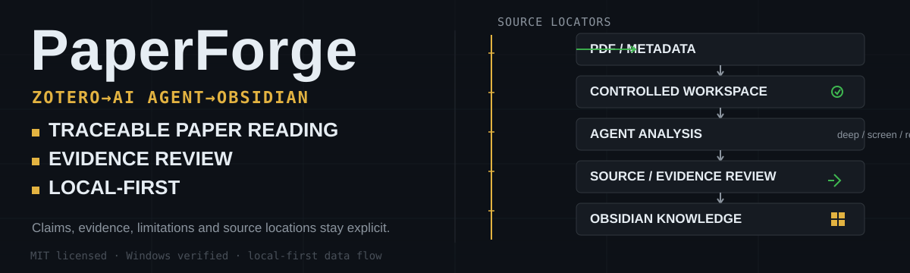

<p align="right">
  <a href="README.md">English</a> | <a href="README.zh-CN.md">简体中文</a>
</p>

<p align="center">
  
</p>

# PaperForge

[](https://github.com/Lurek-st/PaperForge/actions/workflows/ci.yml)

**PaperForge is a local-first Zotero → AI Agent → Obsidian workflow for traceable academic paper reading, structured evidence review, and long-term research knowledge management.**

It is **not** a generic paper summarizer. It builds a controlled reading workspace where claims, evidence, limitations, source locations, transfer hypotheses, and recall are kept explicit.

## Workflow

```text
Zotero
  (source of truth for PDF + standard metadata)
        ↓
PaperForge
  (controlled work package + analysis workspace)
        ↓
Codex / Agent
  (reads PDF, fills structured analysis with source locators)
        ↓
PaperForge
  (validates structure + completeness, exports to Obsidian)
        ↓
Obsidian
  (long-term knowledge network, personal annotations, links)
```

PaperForge keeps four properties explicit at every step:

- **Local-first** — your PDFs, workspace, Profile, and Obsidian Vault stay on your own disk. Nothing is auto-uploaded to GitHub.
- **Traceable** — every key claim carries a source locator back to the PDF (page, section, table, figure, experiment, or an explicit `Unknown`).
- **Source-located** — author claims, paper facts, and PaperForge judgment are recorded as separate rows, never merged into one summary.
- **Evidence-aware** — placeholder language and gap markers (`paper_not_reported`, `not_verified_in_alpha`, `unavailable_without_repo_check`, `unknown_from_pdf_only`) prevent incomplete work from looking complete.

## Why PaperForge

Most AI paper tools produce a summary that looks like a conclusion. PaperForge is built for researchers who need to keep three things separate:

1. **What the paper actually says** (paper fact)
2. **What the authors claim** (author claim)
3. **What is reasonable to infer or transfer** (PaperForge judgment, grounded in your Research Profile)

PaperForge does not try to replace judgment with a summary. It builds a controlled reading workspace where claims, evidence, limitations, source locations, transfer hypotheses, and recall are kept explicit.

The core argument chain is preserved end to end:

```text
problem -> prior limitation -> intervention -> mechanism -> evidence -> limitation -> transfer hypothesis -> recall
```

## Who PaperForge is for

PaperForge fits if you:

- already use Zotero to store papers and want reading results to be **revisitable, transferable, and traceable**, not one-shot summaries
- want to deposit deep reading into a long-term Obsidian knowledge base (researcher, engineer, student, founder)
- want an Agent to follow a fixed structure for deep reading instead of producing a single free-form summary
- care about source locators, claim/evidence separation, persistent Profile, and explicit limitations

PaperForge is **not** a fit if you:

- only want a quick paraphrase and do not need source location or long-term notes
- do not use Zotero or Obsidian and do not plan to maintain a local Markdown workflow
- expect a system to "read every paper for you" and guarantee correctness

## What PaperForge does

| Component | Responsibility | Does NOT do |
|---|---|---|
| **Zotero** | Source of truth for PDFs, standard metadata, DOI/arXiv, collections, item keys | Run PaperForge-style evidence review |
| **PaperForge** | Initialize the controlled work package, structure deep analysis, validate completeness, export to Obsidian | Auto-claim that paper conclusions are correct |
| **Codex / Agent** | Read the PDF, fill structured analysis files following the PaperForge Skill | Manage the Zotero database |
| **Obsidian** | Long-term Markdown knowledge network, bidirectional links, personal annotations, review | Act as a primary source of PDF facts |

## What PaperForge does NOT do

PaperForge will **not**:

- auto-upload your PDFs, workspace, Obsidian notes, or Profile to GitHub
- auto-modify Zotero `storage/` or `zotero.sqlite`
- auto-write tags to Zotero items
- fabricate full-text analysis when the PDF is missing
- present deep analysis results as "guaranteed correct"
- replace expert peer review
- run any paper's repository code or downloaded scripts automatically
- weaken source-locator requirements, evidence boundaries, or prompt-injection protections

PaperForge is **local-first**, **traceable**, **source-located**, and **evidence-aware** by design — not by marketing.

## Quick Start

```bash
git clone https://github.com/Lurek-st/PaperForge.git
cd PaperForge
python skills/paper-forge/scripts/paperforge.py doctor
python skills/paper-forge/scripts/paperforge.py init
python skills/paper-forge/scripts/paperforge.py ingest-zotero
```

`ingest-zotero` prints the real paper ID for each imported item:

```text
paper_id: zotero:<key>
```

Copy the actual `paper_id` printed by the CLI and run `deep` against it:

```bash
python skills/paper-forge/scripts/paperforge.py deep zotero:<key>
```

`deep` requires a real work package produced by `ingest-zotero` (or by the manual `--metadata` import below). It never invents content for an ID that was never imported.

If you do not have a Zotero library yet, PaperForge supports manual import from a metadata JSON (exported from Zotero or prepared by hand), with an optional PDF:

```bash
python skills/paper-forge/scripts/paperforge.py ingest-zotero --metadata path/to/metadata.json [--pdf path/to/source.pdf]
python skills/paper-forge/scripts/paperforge.py deep --metadata path/to/metadata.json [--pdf path/to/source.pdf]
```

Manual imports also print a derived `paper_id` (for example `paper_id: doi:10.1000/example`) that you can pass to `deep`.

> **Note:** Examples such as `zotero:EXAMPLE123` elsewhere in this documentation are illustrative placeholders. They are not preloaded sample data — running them as-is fails with `No PaperForge work package found for <target>`.

## Installation

### Prerequisites

Required:

- Git, or a way to download a ZIP from GitHub
- Python 3.9 or newer
- Zotero Desktop
- Your own Zotero library
- Obsidian
- An environment that can run Codex / Agent (such as Codex CLI or Claude Code)

Optional:

- GitHub Desktop
- VS Code
- A standalone Python virtual environment

Currently verified:

- **Windows** — verified
- **macOS / Linux** — expected to work; configure Python the same way and verify on your own machine

### Get the source

Option A — Git clone:

```bash
git clone https://github.com/Lurek-st/PaperForge.git
cd PaperForge
```

Option B — Download ZIP:

```text
GitHub page -> Code -> Download ZIP -> extract -> open a terminal in the PaperForge folder
```

### (Optional) Create a virtual environment

Windows:

```bash
python -m venv .venv
.venv\Scripts\activate
```

macOS / Linux:

```bash
python3 -m venv .venv
source .venv/bin/activate
```

PaperForge has no third-party runtime dependencies. The core commands work with the Python standard library.

### Verify the environment

```bash
python skills/paper-forge/scripts/paperforge.py doctor
```

You should see output such as:

- `PaperForge doctor`
- `Workspace root`
- `Obsidian vault`
- `Zotero Desktop Local API is reachable` or an explicit failure reason

## Configuration

### First-time setup

```bash
python skills/paper-forge/scripts/paperforge.py init
```

This creates the user-level configuration and workspace directories. By default, PaperForge uses:

```text
PAPERFORGE_HOME not set:
~/.paper-forge/
```

You can override the location with:

```text
PAPERFORGE_HOME=<your-paperforge-data-directory>
```

### Keep these directories separate

```text
<project-root>/PaperForge            <-- this repository
<your-paperforge-data-directory>     <-- controlled workspace
<your-zotero-data-directory>         <-- owned by Zotero
<your-obsidian-vault>                <-- owned by you
```

Recommended layout:

```text
<project-root>/PaperForge
├── skills/
├── docs/
├── tests/
├── profile.example.md
├── paperforge-config.example.yaml
├── CHANGELOG.md
└── README.md

<your-paperforge-data-directory>
├── config.yaml
├── profile.md
├── workspace/
│   ├── inbox/
│   ├── processing/
│   ├── cache/
│   ├── failed/
│   ├── archive/
│   └── logs/
└── obsidian-vault/
```

Configuration templates:

- [paperforge-config.example.yaml](paperforge-config.example.yaml)
- [skills/paper-forge/assets/default-config.yaml](skills/paper-forge/assets/default-config.yaml)

User-level config lives at:

```text
~/.paper-forge/config.yaml
```

or:

```text
<PAPERFORGE_HOME>/config.yaml
```

Key configuration fields:

| Field | Purpose |
|---|---|
| `zotero.data_directory` | Path to your own Zotero data directory |
| `workspace.root` | PaperForge workspace root inside your user data directory |
| `obsidian.vault_path` | Path to your own Obsidian Vault |
| `language.default_output_language` | Default language for `deep` analysis |
| `language.obsidian_note_language` | Language for Obsidian filenames, page titles, and navigation |

## Zotero integration

PaperForge reads Zotero data through the Zotero Local API. This path is **read-only**:

- read paper metadata
- locate PDF attachments
- build a PaperForge work package

It will **not**:

- auto-modify Zotero local items
- auto-write tags to Zotero items
- auto-rewrite Zotero collections

Suggested setup:

1. Install and start Zotero Desktop.
2. Create a `PaperForge Inbox` collection in Zotero, or use your own collection name in the config.
3. Use the Zotero Connector to save papers and PDFs.
4. Run:

   ```bash
   python skills/paper-forge/scripts/paperforge.py doctor
   ```

   On success you should see:

   ```text
   Zotero Desktop Local API is reachable.
   ```

Common failure causes:

- Zotero Desktop is not running
- Local API is disabled
- Local port is unreachable
- The item has no PDF
- The collection name in the config does not match Zotero

## Obsidian integration

Obsidian is the long-term knowledge network destination of PaperForge. You must provide your own Vault path in the configuration:

```text
obsidian:
  vault_path: "<your-obsidian-vault>"
```

PaperForge only writes to that location.

Protection policies:

- Existing notes are not overwritten by default
- Legacy `00.md` through `05.md` archives are detected and skipped by default
- Different-language title variants are not silently duplicated

## Research Profile

Templates are provided in the public repository:

- [profile.example.md](profile.example.md)
- [skills/paper-forge/assets/profile-template.md](skills/paper-forge/assets/profile-template.md)

The real, active Profile lives outside the repo at:

```text
~/.paper-forge/profile.md
```

or:

```text
<PAPERFORGE_HOME>/profile.md
```

Option 1 — copy the template directly:

Windows:

```bash
copy profile.example.md %USERPROFILE%\.paper-forge\profile.md
```

macOS / Linux:

```bash
mkdir -p ~/.paper-forge
cp profile.example.md ~/.paper-forge/profile.md
```

Option 2 — use the init script:

```bash
python skills/paper-forge/scripts/init_profile.py
```

The Profile affects:

- which problems the `deep` analysis emphasizes
- which engineering or research constraints the transfer analysis focuses on
- the default output language
- the language of Obsidian titles and filenames
- the preferred level of detail

Recommended fields:

| Field | Purpose |
|---|---|
| `default_output_language` | `deep` analysis default: `auto` / `zh` / `en` / `bilingual` |
| `obsidian_note_language` | Obsidian filename, title, and navigation language |
| `preferred_detail_level` | Detail-level preference |
| `Research Interests` | Long-running topics you care about |
| `Priority Questions` | The questions that matter most when evaluating a paper |
| `Reliability And Transfer Priorities` | Engineering stability, reproducibility, deployment constraints, etc. |

Do **not** write to your Profile:

- passwords
- tokens
- API keys
- ID documents
- addresses
- any personal privacy unrelated to paper analysis

## Language behavior

PaperForge supports four language modes:

| Mode | `deep` analysis language | Obsidian filename / title / navigation |
|---|---|---|
| `zh` | Chinese | Chinese |
| `en` | English | English |
| `bilingual` | Chinese + English | Chinese + English |
| `auto` | Auto-detect | Auto-detect |

Priority:

```text
CLI explicit flag
>
profile.md
>
config.yaml
>
auto fallback rules
```

`auto` rules:

- `deep` analysis language: if no more specific setting, fall back to `fallback_output_language` in config
- Obsidian note language: if still `auto`, follow the resolved `deep` output language; if still unresolved, fall back to English

CLI override example:

```bash
# zotero:EXAMPLE123 is an illustrative placeholder; use the real paper_id printed by ingest-zotero
python skills/paper-forge/scripts/paperforge.py export-obsidian zotero:EXAMPLE123 --language zh --obsidian-language bilingual
```

Resulting Obsidian filename examples:

```text
zh:
01 - 论文定位、旧路径局限与真实贡献.md

en:
01 - Problem, Prior Limitation, Actual Contribution.md

bilingual:
01 - 论文定位、旧路径局限与真实贡献 | Problem, Prior Limitation, Actual Contribution.md
```

## `screen` / `deep` / `recall`

PaperForge uses exactly three reading modes:

- `screen` — quick triage to decide whether a paper deserves deep reading
- `deep` — full traceable analysis, structural validation, completeness check, optional Obsidian export
- `recall` — Feynman-style active recall inside the same Skill

`deep` does **not** itself perform the semantic analysis. It creates or reuses the workspace, runs structural validation, runs completeness checks, and exports to Obsidian when the analysis is filled. The actual semantic deep reading is performed by Codex / Agent following the PaperForge Skill, which fills these files:

```text
analysis/01_triage.md
analysis/02_claim_ledger.md
analysis/03_contribution_map.md
analysis/04_mechanism.md
analysis/05_evidence_audit.md
analysis/06_transfer_analysis.md
analysis/07_final_brief.md
learning/08_recall_log.md
```

Reference prompt for the Agent (`zotero:EXAMPLE123` is an illustrative placeholder — substitute the real paper ID):

```text
Use the PaperForge deep workflow to analyze zotero:EXAMPLE123.
Read the PDF, fill analysis/*.md according to the Profile and selected language.
Every key conclusion must carry a traceable source locator.
Separate paper facts, author claims, and PaperForge judgment.
```

A reference example end-to-end transcript is provided in [docs/DEMO_TRANSCRIPT.md](docs/DEMO_TRANSCRIPT.md).

## Obsidian output structure and reading order

Example layout:

```text
<your-obsidian-vault>/
└── Papers/
    └── 2026-07-04__Example_Paper__EXAMPLE123/
        ├── 2026-07-04__Example_Paper__EXAMPLE123.md
        ├── 00 - Source, Metadata, Profile Snapshot.md
        ├── 01 - Problem, Prior Limitation, Actual Contribution.md
        ├── 02 - Mechanism, Method, Causal Chain.md
        ├── 03 - Claims, Evidence, Limitations, Unproven Parts.md
        ├── 04 - Transfer Analysis, User Research Relevance, Project Ideas.md
        ├── 05 - Feynman Recall, Self-Explanation, Open Questions.md
        └── paperforge-manifest.json
```

Recommended reading order:

```text
home note
→ 01
→ 02
→ 03
→ 04
→ 05
read 00 only when you need source, metadata, or PDF location
```

What each file answers:

| File | Question it answers | When to read it |
|---|---|---|
| `00` | Source, metadata, Zotero link, Profile snapshot | When you need to verify a source |
| `01` | What problem the paper solves, why prior work falls short | At the start of a new read |
| `02` | How the method works, what the causal chain is | For mechanism understanding |
| `03` | Does evidence really support the claims, what is unproven | For evidence review |
| `04` | Can this transfer to your own research or engineering scenario | For transfer judgment |
| `05` | Can you really explain it yourself | For review and recall |

Always keep these three categories separated:

- **Paper fact** — what the paper actually states, what the experiments actually show
- **Author claim** — how the authors interpret their own method and results
- **PaperForge judgment** — credibility, transferability, and risk judgment grounded in evidence

## Evidence and source-locator philosophy

PaperForge is opinionated about three boundaries:

1. **Claims are not evidence.** Every claim row in `02_claim_ledger.md` carries a `Source Locator` and a `Direct Evidence` field. If a claim cannot be verified from the available source material, it is marked `Unknown` and the missing piece is named.
2. **Source locators must be honest.** PaperForge never invents page numbers, figure IDs, table IDs, experiment IDs, source lines, or quotations. When exact PDF pages are unavailable, the locator says `PDF page Unknown` and gives the best available section, figure, table, appendix, DOI, arXiv ID, URL, or HTML locator.
3. **The Agent's output is not automatically evidence.** PaperForge treats the Agent's draft the same way it treats a paper: a structured reading artifact, not a fact verdict. The user is expected to verify important claims against the original PDF.

These rules exist because PaperForge is a **reading tool**, not a truth engine.

## Data safety

PaperForge is designed around these safety boundaries:

1. Does not auto-upload PDFs, workspace, Obsidian notes, or Profile to GitHub
2. Users should keep papers, workspace, and Vault outside the repo, or ensure they are git-ignored
3. Reads Zotero data through the Local API
4. The Local API path is currently read-only
5. Does not auto-write tags to Zotero items
6. Does not fabricate full-text conclusions when the PDF is missing
7. Critical conclusions still require checking the original PDF, figures, experiment settings, and appendices
8. Never commit API keys, tokens, private PDFs, personal Profile, or Vault to Git

The full security model is documented in [docs/SECURITY_MODEL.md](docs/SECURITY_MODEL.md).

## Testing

Run the automated test suite:

```bash
python -m unittest discover -s tests -p "test_*.py"
```

Before committing, please confirm:

- The main CLI commands run correctly
- `python -m unittest discover -s tests -p "test_*.py"` passes
- You have not added PDFs, `.env`, Profile, Vault output, or user workspace to Git

## Project structure

```text
PaperForge/
├── skills/
│   └── paper-forge/
├── docs/
├── tests/
├── assets/
│   ├── paperforge-hero.svg
│   ├── social-preview.svg
│   └── social-preview.png
├── profile.example.md
├── paperforge-config.example.yaml
├── CHANGELOG.md
├── LICENSE
└── README.md
```

## Contributing and issues

Contributions, bug reports, documentation fixes, and reproducible test cases are welcome. See [CONTRIBUTING.md](CONTRIBUTING.md) for guidelines.

Especially welcome:

- installation fixes
- Zotero compatibility reports
- Obsidian export issues
- source-locator and evidence-traceability improvements
- cross-platform verification
- reproducible bug reports
- tests
- documentation

Please do not commit:

- private PDFs
- real Zotero data
- personal Profile
- Obsidian Vault
- `.env`
- tokens, API keys, or credential files

Further reading:

- [CHANGELOG.md](CHANGELOG.md)
- [CONTRIBUTING.md](CONTRIBUTING.md)
- [docs/workflow.md](docs/workflow.md)
- [docs/obsidian-structure.md](docs/obsidian-structure.md)
- [docs/troubleshooting.md](docs/troubleshooting.md)
- [docs/LIMITATIONS.md](docs/LIMITATIONS.md)

## License

PaperForge is released under the MIT License.

See [LICENSE](LICENSE).
