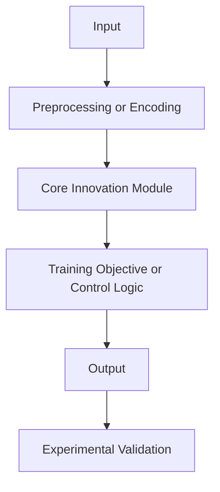

# Mechanism Model

## Inputs

Unknown.

Source locator: Unknown.

## Key Internal Stages

Unknown.

Source locator: Unknown.

## Stage Purposes

Unknown.

Source locator: Unknown.

## Outputs

Unknown.

Source locator: Unknown.

## Least Replaceable Stage

Unknown.

Source locator: Unknown.

## Mechanism Change

Unknown.

Source locator: Unknown.

## Likely Failure Points

Unknown.

Source locator: Unknown.

## Mermaid Causal Chain

Source locator: Unknown.

## Key Assumptions

- Unknown.

Source locator: Unknown.

## Failure Conditions

- Unknown.

Source locator: Unknown.
